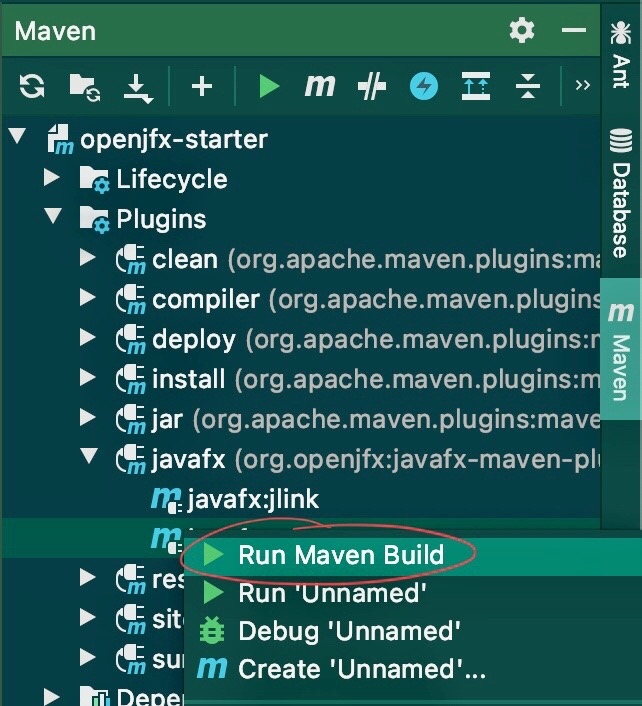
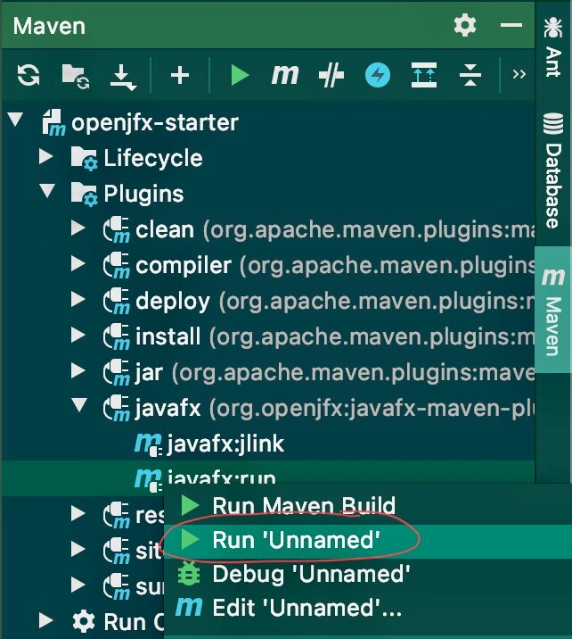
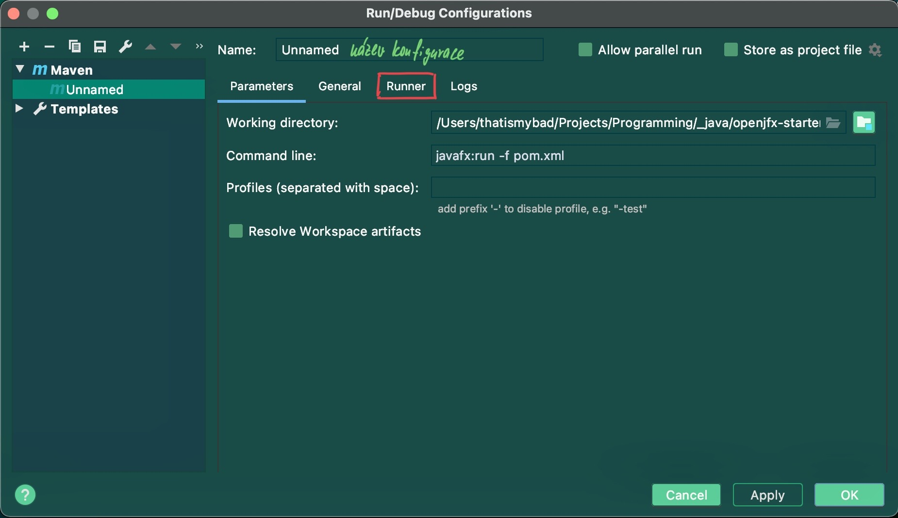
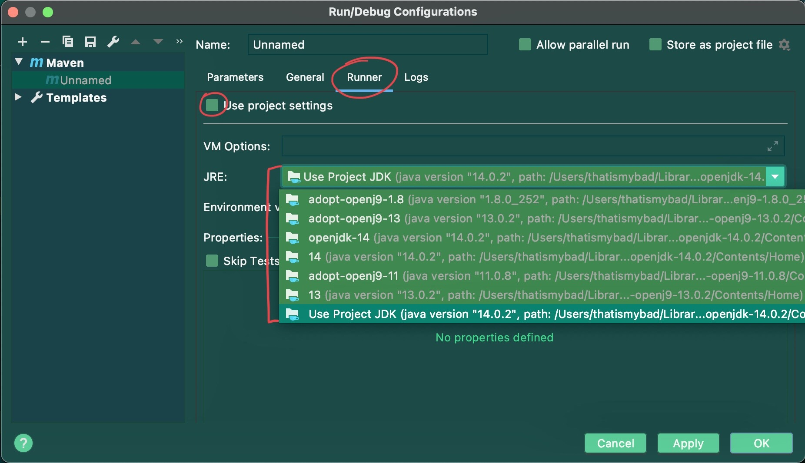

# Startovací JavaFX projekt (openjfx.io)

**Maven** šablona projektu s JavaFX (v15) + FXML, Java (v14) pro rychlý start.

## Spuštění projektu

1. naklonování projektu - **fork** nebo **clone**

2. nastavení požadovaných verzí v `pom.xml` v bloku `<properties>...</properties>` (verze Java a JavaFX se mohou lišit):
	a. Java => `java-version`
	b. JavaFX => `javafx-version`
	
3. spuštění aplikace: `Maven` > `openjfx-starter` > `Plugins` > `javafx:run`

	
	
nebo

	
	
## Úprava konfigurace: 

1. spuštění aplikace přes pravé kliknutí tlačítka myši na `javafx:run` a "**Run 'Unnamed'**"

	
	
2. otevřít editor konfigurací

	
	
	

3. pro zvolení jiné verze Javy pro spouštění aplikace:
	-  záložka "**Runner**"
	- odškrtnutí "**Use project default**"
	- zvolení požadované verze JRE
		- (doporučená verze Javy je alespoň 11+)
		
	

## Řešení problémů

1. Aplikace nelze spustit:

    - pokud by aplikace nešla spustit, možné řešení může být ve změně JRE (pokud se aplikace spouští pod verzí 1.8)  => změna JRE na vyšší než 1.8 (viz. **Úprava konfigurace**)

	

